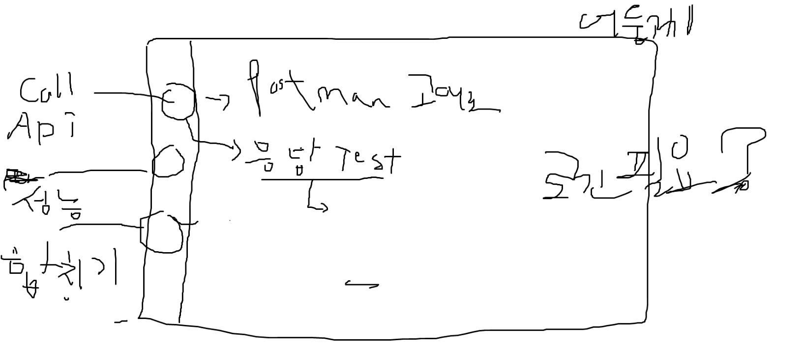
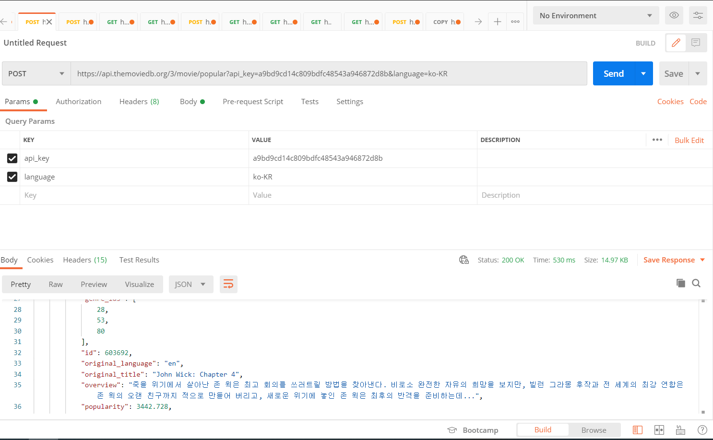

## 구상

### 레이아웃

라우터대신 퍼널 사용해서 간단하게 (토스 slash23 참고)





API 검증 화면
- API 여러개 추가 가능한이유? 한 User가 여러개의 API를 호출할 수 있게 테스트를 하기 위함 (동시에 호출, 순차적 호출)
- 쓰레드란? User
- ex) 쓰레드 2, 반복횟수 2, 인터벌 30초
  1. User 2명이 동시에 설정한 API 를 호출함
  2. 이때 동시성 활성화 > 설정한 API가 어려개면 User는 API를 동시에 호출
  3. 이때 동시성 비활성화 > 설정한 API가 어려개면 User는 API를 순차적에 호출
  4. User 2명의 호출이 다 완료되면 인터벌 시간만큼 대기
  5. 반복 횟수 만큼 1~4번 반복 


### API Call 규격 : /api/call

Request

```
{
  "time": {
    "connectionTime": 0,
    "readTime": 0,
    "writeTime": 0
  },
  "count": 0, // 호출 횟수, 기본 1
  "url": "string",
  "httpMethod": "string", // get, post, put, delete, patch 중 하나
  "param": {
    "param1": "string",
    "param2": "string",
    ...
  },
  "header": {
    "header1": "string",
    "header2": "string",
    ...
  },
  "body": {
    ...
  }
}
```

Response

```
[
  {
    "responseTime": 0, //응답 시간
    "body": {}, //응답값 body
    "header": {
      "key" : [] //여러값이 올 수 있어서 list임
    }, //응답값 header
    "cookie": [
      {
        "name" : "String",
        "value" : "String",
        "comment" : "String",
        "commentURL" : "String",
        "toDiscard" : Boolean,
        "domain" : "String",
        "maxAge" : long,
        "path" : "String",
        "portlist" : "String",
        "secure" : Boolean,
        "httpOnly" : Boolean,
        "version" : int,
        "header" : "String",
        "whenCreated" : long,
      }
    ], //응답값 cookie
    "url" : "String", //요청 url
    "httpMethod" : "String", //요청 method
    "status": "string" // 200, 500 등의 상태 코드
  },
  ... //Request의 count횟수 만큼 list에 담아서 전달
]
```


### API 검증 규격 (웹 소켓) : /api/perform/socket-connect
- Request
```
{
    "userCount": 10,
    "repeatCount": 1,
    "interval" : 0,
    "requestDataList" : {
        "performType" : "CONCUR", // "SEQ"
        "requestList" : [
            {
                "time": {},
                "count": 1, //검증 테스트시에는 1로 고정
                "url" : "https://jsonplaceholder.typicode.com/todos/1",
                "httpMethod" : "GET",
                "param" : {},
                "header" : {},
                "body" : {}
            }
        ]
    }
}
```

- Response
```
{  
    "responseList": [{
    "responseTime": 0, //응답 시간
    "body": {}, //응답값 body
    "header": {
      "key" : [] //여러값이 올 수 있어서 list임
    }, //응답값 header
    "cookie": [
      {
        "name" : "String",
        "value" : "String",
        "comment" : "String",
        "commentURL" : "String",
        "toDiscard" : Boolean,
        "domain" : "String",
        "maxAge" : long,
        "path" : "String",
        "portlist" : "String",
        "secure" : Boolean,
        "httpOnly" : Boolean,
        "version" : int,
        "header" : "String",
        "whenCreated" : long,
      }
    ], //응답값 cookie
    "url" : "String" //요청 url
    "httpMethod" : "String" //요청 method
    "status": "string" // 200, 500 등의 상태 코드
  },
  ...
  ],
    "totalTime" : 10,
    "result" : true,
    "userId": "USER-6"
}
```


### 컴포넌트 기반 개발

- TDD로 진행
  - 스토리북, jest, rtl 활용 테스트
  - emotion, framer, scss로 애니메이션과 스타일링
  - atomic, compound 패턴 활용

### 전역 상태관리

- recoil만 사용?

### 에러처리

- ErrorBoundary, Suspense 활용하기

### 할 일

- API 호출

  - 시간 설정 (Time 탭으로 감)
  - 재렌더링 이슈
  - 드래그해서 res, req탭 높이 조정
  - 빈 url일 때 못보내게 하기
  
- 성능 테스트

  - 편집 페이지
    - 아코디언 렉 졸라 심한거 고치기
    - api 아코디언에 삭제 버튼 달기
    - input 창 불편함
    - 빈 url일 때 못보내게 하기
    
  - 결과 페이지
    - response의 request url, method등 도 보여줘야함
    
    - testResponse하나당 1개로 해서 걔의 responseList를 탭으로 오른쪽 detail에서 보여주는 형태로 변경
    
    - result 값 말고 true false 동그라미로
    
    - 그래프 만들기
    
      

- 다크모드

- 배포해서 SEO, 성능, 접근성 최적화

- 스토리북 도입

  ## 일정

  - API 합치기, 다크모드
    - 나중에 함
  - 1차 배포 (2.3)
    - 도메인 사기
    - 클라우드 활용
      - node로 프론트서버
  - 배포 하고
    - SEO , 접근성, 성능 최적화
    - 에러 모니터링 설정 sentry

  

  
